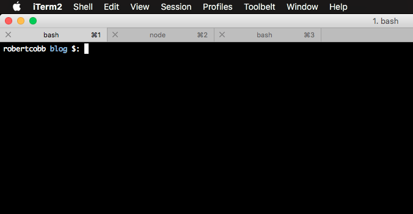
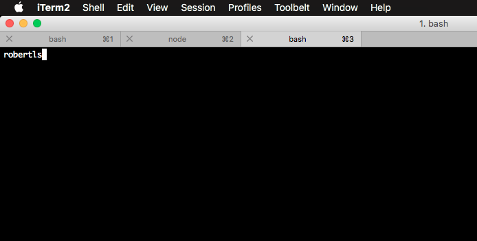

1. [Overview](#sec-1-1)
2. [TLDR;](#sec-1-2)
3. [Intro](#sec-1-3)
4. [Problem](#sec-1-3-1)

    a. [Background - PS1 and `tput`](#sec-1-4)

    b. [PS1 (not the playstation)](#sec-1-4-1)

    c. [`tput`](#sec-1-4-2)

5. [Diagnosing this particular problem](#sec-1-5)
6. [References](#sec-1-6)


## Overview<a id="sec-1-1"></a>

In today's yak shave, we'll be bebugging terminal prompt messed-up-edness.

You know how you see people with really cool terminal prompts in screencasts?

Gary Bernhart / Julia Evans / Dan Abramov / etc: 😎

Me: 👀

The problem is that messing with your terminal sometimes breaks things! Per always, a little patience, curiosity, and googling solves it. (but really -- any excuse for a yak shave!)

## TLDR;<a id="sec-1-2"></a>

Broken

```bash
export PS1="\[\u $(tput bold)$(tput setaf 4)\]\W\[$(tput sgr0)\] \$: "
```

Fixed

```bash
export PS1="\u \[$(tput bold)$(tput setaf 4)\]\W\[$(tput sgr0)\] \$: "
```

With help from:
-   [unix stackexchange](https://unix.stackexchange.com/questions/28827/why-is-my-bash-prompt-getting-bugged-when-i-browse-the-history)
-   and this [nixCraft blog post](https://www.cyberciti.biz/tips/howto-linux-unix-bash-shell-setup-prompt.html)

## Intro<a id="sec-1-3"></a>

For a long time, I was using [liquidprompt](https://github.com/nojhan/liquidprompt) to style my prompt. It worked pretty great!

- the setup was easy
- the defaults rocked
- customization was sensible

But, it cost me a _teensy_ bit of startup time when I opened a new terminal tab. Plus, I wanted to understand what was happening with my terminal, and control it myself!

So I decided to learn a little bit and use a prompt of my own design. "Foolish", you might say. "Why not spend your time doing something useful instead?" Bah!

I took liquidprompt out of my config and added a little sumthin to my \`.bashrc\`:

```bash
export PS1="\[\u $(tput bold)$(tput setaf 4)\]\W\[$(tput sgr0)\] \$: "
```

Neat-o! Now my terminal looks like:



### The Problem<a id="sec-1-3-1"></a>

I started noticing that sometimes, especially when I scrolled backwards through my bash history, my prompt would get messed up.



My cursor wouldn't show where I expected, the text got bumped all over, everything was pretty messed up. I could clear the screen with `ctrl-l` or `cmd-k`, which got me back to a working state. But I couldn't scroll up and edit previous commands, and forget about searching bash history with `ctrl-r`. 😭😭😭

Time to strap on the bug-stomping shoes and start googling!

 🕵 🐛 👞

## Background: PS1 and tput<a id="sec-1-4"></a>

First, amusing: searches for _PS1 console_ get results for the Sony gaming machine. _PS1 variable_ gets results for the bash variable.

There's a good guide to PS1 from Vivek Gite at [nixCraft](https://www.cyberciti.biz/tips/howto-linux-unix-bash-shell-setup-prompt.html)

Following the guide, you might `echo $PS1`. I know I did.

And you might ask yourself: WTF is `bash±\\u@\h \\W]\\$`?

### PS1 (not the playstation):<a id="sec-1-4-1"></a>

-   `PS1` is a bash variable that sets the prompt
-   Prompts like PS1 have a DSL! (Domain Specific Language)
-   `\u`, `\h`, `\W` - all of these **mean something** to bash
-   `\u` is the current user's username, `\h` is the hostname up to the first `.`, `\W` is the basename of the current working directory
-   (More in the list in the post above)

### tput<a id="sec-1-4-2"></a>

-   `tput` is freakin cool for styling terminal output (among other things)
-   It's a utility that comes with the [ncurses](https://www.gnu.org/software/ncurses/) package. (if you can use `clear`, you might have ncurses)
-   It inserts _non-printing characters_ that change color, bold, and back
-   For instance, `tput bold` prints out `\033[1m$`

This doesn't show up in the terminal -- it turns text to bold!

### Prompt Breakage:

A critical piece of the list of PS1 options mentioned in the cyberciti post above:

```text
\[ : begin a sequence of non-printing characters which could be used to embed a terminal control sequence into the prompt
\] : end a sequence of non-printing characters
```

This is how terminals get messed up!

Let me expand:

-   Bash is keeping track of how many characters are in your prompt
-   if you have characters that _don't print_ in your prompt (like `tput bold`), bash thinks your cursor is further than it should be
-   if you have characters in between `\[` these guys `\]`, bash does not count them for determining where your cursor goes

## Diagnosing this particular problem<a id="sec-1-5"></a>

Now that we've got a picture for how the `PS1` variable works and how `tput` is styling the prompt, we can debug!

My broken `PS1` was:

```bash
export PS1="\[\u $(tput bold)$(tput setaf 4)\]\W\[$(tput sgr0)\] \$: "
```

Look! The `\u` in my `$PS1` is inside of these bad boys `\[` `\]`! That means bash thinks that the output of `\u` (my username, `robertcobb`) is non-printing characters.

> Brain blast: _bash won't count my username as characters for the prompt_ 🤯

Now that I understand the bug, the solution is easy:

```bash
export PS1="\u \[$(tput bold)$(tput setaf 4)\]\W\[$(tput sgr0)\] \$: "
```

Moving the `\u` outside of the non-printing section means that bash will count it towards my prompt characters. If it can get the count right, it won't show my cursor in the wrong spot or otherwise 'be all messed up'.

Now I can scroll through my bash history without my prompt getting b\*rked 😌.

## References<a id="sec-1-6"></a>

- <https://unix.stackexchange.com/questions/28827/why-is-my-bash-prompt-getting-bugged-when-i-browse-the-history>
- <https://unix.stackexchange.com/questions/191004/bash-the-prompt-gets-visually-broken>
- <https://unix.stackexchange.com/questions/213504/how-to-print-control-characters-with-escape-sequences>
- <https://www.cyberciti.biz/tips/howto-linux-unix-bash-shell-setup-prompt.html>
- <http://linuxcommand.org/lc3_adv_tput.php>
