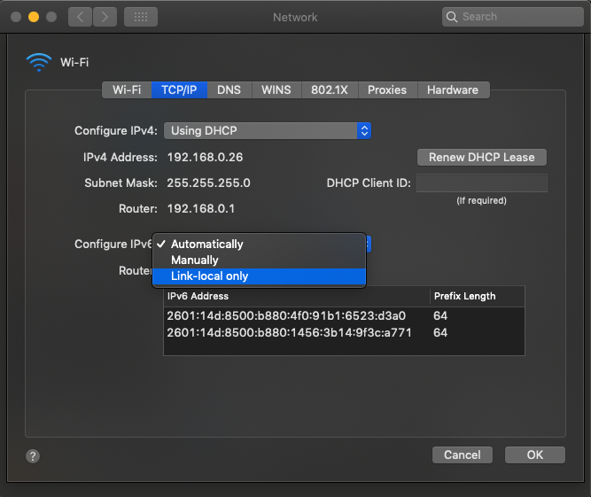

1. [Overview](#sec-1-1)
2. [TLDR;](#sec-1-2)
3. [Intro](#sec-1-3)
4. [Investigation](#sec-1-4)

    a. [Is it my version of ruby?](#sec-1-4-1)

    b. [Is it something with SSL?](#sec-1-4-2)

    c. [Is it even my computer?](#sec-1-4-3)

5. [Diagnoses and explanation](#sec-1-5)

    a. [curl -6](#sec-1-5-1)

    b. [lsof](#sec-1-5-2)

    c. [dig and nmap](#sec-1-5-3)

    d. [router settings](#sec-1-5-4)

6. [The Fix](#sec-1-6)

6. [References](#sec-1-7)

## <a id="sec-1-1"></a>Overview

Just in time for Halloween, we're back again with another yak shave! This time it's a doozy - `gem install` wasn't working, and it turned out to be an issue...

_IN THE NETWORK STACK!_ 😱

I got to play with a _ton_ of network tools. `curl`, `dig`, `lsof`, and a totally new one to me, `nmap`. I don't go into how to install these on your machine, but my explanations of how I use them are situated in the narrative context, so you should be able to follow along, even if you haven't done a lot with these tools yourself yet.


In case you're catching up, 'yak shave' on this blog means a deep dive into some hairy mess. Here's a neat [piece on the origin of the term](http://www.alexandrasamuel.com/toolbox/yak-shaving-etymology).


## <a id="sec-1-2"></a>TLDR;

¯\\\_(ツ)_/¯

```
$ gem install bundler
ERROR:  Could not find a valid gem 'bundler' (>= 0), here is why:
          Unable to download data from https://rubygems.org/ - timed out (https://api.rubygems.org/specs.4.8.gz)
```

after hanging for a while. Spooky.

Fixed

> [Mac OSX] System Preferences > Network > Advanced > TCP/IP > Configure IPv6: Link-local only

With help from:
- [Stackoverflow](https://stackoverflow.com/questions/49800432/gem-cannot-access-rubygems-org)
- [RubyGems forum](http://help.rubygems.org/discussions/problems/31074-timeout-error)
- My roommate [@JaxGeller](https://twitter.com/JaxGeller) keeping me sane (he'd had the same issue!)

And absolutely no h*cking help from:
- [Rubygems Github Issue](https://github.com/rubygems/rubygems/issues/2253)
- [RubyGems forum](http://help.rubygems.org/discussions/problems/26201-gemremotefetcherunknownhosterror)
- [Bundler Docs](https://bundler.io/v1.16/guides/rubygems_tls_ssl_troubleshooting_guide.html#automated-ssl-check)
- [Stackoverflow](https://stackoverflow.com/questions/41597169/unknown-host-error-while-updating-ruby-gems)
- About 50 other stackoverflow answers, github issues, and forum comments

This one was tricky, so it's hard to blame the poor folks whose posts led me astray, but I'm still a little salty that there were so many dead ends on this one. Dead ends... spooky! 👻👻👻

## <a id="sec-1-3"></a>Intro

I recently moved into a new apartment, and gained the new ability to _leave my work laptop at work_. Hence, a recent switch of wifi networks, and a dusting-off-of-cobwebs 🕸 of my old laptop (mid-2012, so... not that old).

I hadn't coded on it in a while, but wanted to get some old side projects up and running again (e.g. this blog). Much of my workflow is now in a js stack, for better or for worse. It was only when I tried to get an old side project running that I noticed something strange: I couldn't install any gems!

For those of you unfamiliar, 'gems' are ruby's packages - it's usually a really painless package management experience. `gem install package-name`, and voilà! If you are managing a project, there's a complementary tool - [bundler](https://bundler.io/) - that reads your `Gemfile` and installs the packages listed there when you run `bundle install`. That way, you and your friends can make sure you have the same packages installed when you collaborate on a ruby project.

However, all of that depends on being able to install gems in the first place! When I ran `gem install bundler`, it would hang for two or three minutes, and eventually report

```
ERROR:  Could not find a valid gem 'bundler' (>= 0), here is why:
          Unable to download data from https://rubygems.org/ - timed out (https://api.rubygems.org/specs.4.8.gz)
```

I remained calm. I googled the error.

> Narrator: He didn't

## <a id="sec-1-4"></a>Investigation

Like any bug investigation, I started by popping the most general-looking part of the error message into google and opening up the top few links. While at it though, I figured it was time for a good housecleaning.

### <a id="sec-1-4-1"></a>Is it my version of ruby?

Maybe I was nervous. Maybe I had been burned by funky `$PATH` issues too many times before, and maybe it was because I had recently updated my OS to the latest version.

<blockquote class="twitter-tweet" data-conversation="none" data-lang="en"><p lang="en" dir="ltr">A new update was released today or so—Mojave (motto: Welcome to the Desert of the Real).</p>&mdash; Simon DeDeo (@SimonDeDeo) <a href="https://twitter.com/SimonDeDeo/status/1054168244213465089?ref_src=twsrc%5Etfw">October 22, 2018</a></blockquote>

I saw some scary stuff out there about needing to update _everything_. [Rumor had it](https://github.com/Homebrew/brew/issues/4975) that 10.14 changed the permissions in important directories, and getting everything working again might mean starting from scratch. So, instead of being patient, I started at max paranoia and (in a few tabs)

```
$ brew doctor
$ xcode-select --install
$ brew update && brew upgrade
```

I even installed the _actual XCode_ from the App Store. Pretty sure that's not ever necessary. Since I hadn't been on this machine for a while, for good measure, I ran

```
$ which ruby
$ ruby --version
$ which gem
$ gem --version
$ which rvm
$ rvm get head
$ rvm list
```

Just to get a sense of where I was, and to make sure rvm was up to date.

None of these things made any difference to my error output. I was no closer! Maybe my version of ruby was somehow messed up? Try switching.

```
$ rvm use 2.3.3
```

No good. Maybe having the bad version of ruby on my machine is the problem?

```
$ rvm remove 2.2.0
$ rvm remove 2.5.1
$ rvm remove jruby-1.7.19
$ rvm remove 2.2-head
$ rvm remove 2.0.0-p643
```

Okay, so maybe I was hoarding ruby versions. Who doesn't?

Getting rid of them didn't fix anything. Maybe all of rvm is really a mistake?

```
$ rvm implode
```

Uh oh. `rvm implode` failed to remove some files? That's not good. Better clean them up with some swift

```
$ sudo rm -rf ~/.rvm
```

Phew. Now we're back to system ruby.

```
$ gem install bundler
ERROR:  Could not find a valid gem 'bundler' (>= 0), here is why:
          Unable to download data from https://rubygems.org/ - timed out (https://api.rubygems.org/specs.4.8.gz)
```

ugh. 🤦‍

### <a id="sec-1-4-2"></a>Is it SSL?

After some unsuccessful messing with ruby versions, I went back to my debugging roots. Back to Google. Back home.

The first few picks seemed promising:

- https://stackoverflow.com/questions/19132450/error-installing-bundler
- https://github.com/rvm/rvm/issues/3264
- https://teamtreehouse.com/community/i-get-the-error-message-could-not-find-a-valid-gem-bundler-0-in-any-repository-how-can-i-fix-this-issue

That's the same error I'm getting!

Let's see - some seem to suggest it's an issue with SSL certificates. Others seem to think it'll get solved if I just switch `https://rubygems.org` to `http://rubygems.org` as the source:

```
$ gem sources -r https://rubygems.org -a http://rubygems.org
https://rubygems.org is recommended for security over http://rubygems.org

Do you want to add this insecure source? [yn]  n
```

`n` indeed. This just can't be it! I'm desperate, but I'm not _that_ desperate...yet.

Now wait just one minute. SSL certificates and switching from `https` to `http` are two heads of the same bug-hydra! If the problem is that my SSL certificates are wrong, I should just fix them, not switch to an insecure version of rubygems.org.

```
$ rvm osx-ssl-certs update all
```

Okay... still no joy. Well, the bundler docs have a detailed guide on [How to troubleshoot RubyGems and Bundler TLS/SSL Issues](https://bundler.io/v1.16/guides/rubygems_tls_ssl_troubleshooting_guide.html#automated-ssl-check). Maybe I'll just follow the steps in the guide!

First, the automated SSL checker script (cool!)

```
ruby -ropen-uri -e 'eval open("https://git.io/vQhWq").read'
```

> If the output reads “Your Ruby can’t connect to rubygems.org because you are missing the certificate” you have a certificate verification error, and need to update your certs.

> If you instead see “Your Ruby can’t connect to rubygems.org because your version of OpenSSL is too old” your OpenSSL version is old and incompatible with TLSv1.2, and you need to upgrade your OpenSSL and/or recompile Ruby to use a newer version of SSL.

```
With that out of the way, let's see if you can connect to rubygems.org...

Bundler connection to rubygems.org:       failed  ❌  (execution expired)
RubyGems connection to rubygems.org:      failed  ❌  (timed out (https://rubygems.org))
Ruby net/http connection to rubygems.org: failed  ❌

Unfortunately, this Ruby can't connect to rubygems.org. 😡
Even worse, we're not sure why. 😕
```

😂😂😂

😭

Okay, maybe something else is wrong about my SSL config?

> Narrator: It wasn't.

Me: Maybe my version of openssl is too old?

```
$ brew update && brew upgrade openssl
Error: openssl 1.0.2p already installed
```

It wasn't SSL.

There's a whole fascinating rabbit hole of SSL stuff that I went down - but you don't have to! It _is_ worth reading Mislav Marohnić's blog post [SSLError and Rubyist, sitting in a tree](https://mislav.net/2013/07/ruby-openssl/) since it's awesome.

But it wasn't SSL.

See, the problem was that I hadn't actually _read my error message_. More importantly, I hadn't _checked that I had the same error message_ as the folks whose problems the SSL stuff was intended to solve.

> I hadn't checked that I had the same error message

If I had read the error message closely, the actual bug might be fixed by something dumb, like:

```bash
$ gem update --system
```

jk, nope.

```
ERROR:  While executing gem ... (Gem::RemoteFetcher::UnknownHostError)
    timed out (https://api.rubygems.org/latest_specs.4.8.gz)
```

But it could happen!

Googling the `Gem::RemoteFetcher::UnknownHostError` actually does come up with some helpful answers. But by this point, I wasn't sure who to trust.

Helpful commenter [@WedgeSparda](https://github.com/rubygems/rubygems/issues/2253#issuecomment-381109568):

> So I was able to run the installation using tethering with my phone. Any idea why a specific connection is giving error? Any port that I should open on my router?

Did I listen? No.

I was stuck, reading about how bundler handles SSL certificates and messing around with `.pem` files.

### <a id="sec-1-4-3"></a>Is it even my computer?

My roommate walked in. _honey-im-home.gif_

This is one of those times when living with another developer came in handy. 🤓 💻

---

Him, friendly: "How was your day?"

Me, grumpy: "I'm having trouble installing gems."

Him, stunned: "On this wifi network? Me too!"

---

Apparently, the apartment wifi is cursed! Switch to a hotspot - `gem install` works fine! Switch back to our wifi - `gem install` times out. He had experienced the same mysterious bug, and had been considering doing the same dive into SSL certificates that I was doing.

But now there was an interesting new data point - it might not be my laptop that's misconfigured at all!? 🙄😪

By this point, I'm well and truly intrigued. Why would using a different network make a difference? 🤔

## <a id="sec-1-5"></a>Diagnoses and explanation

> Note: When someone else has your bug, it's a _great_ feeling. Shoutout to all those bug-fixers and solution-sharers for sure, but big shoutout to the bug reporters. Solidarity ✊🏻✊🏼✊🏽✊🏾✊🏿

So, switching to the hotspot _worked_ for installing gems. If I didn't have time to kill, I would have stopped there.

But, using a hotspot is a crappy workaround for what should be a pretty normal part of a ruby workflow. Plus, it leaves so much _mystery_ on the table, waiting to be solved! I wouldn't give up that easily.

```
  🕵️‍
  🌳
🌳🐛🌳
  🌳
```
_The bug... it was hiding in those emoji shrubs all along!_

### <a id="sec-1-5-1"></a>curl -6

Okay, now for the real fun - diagnostic network tools!

I knew that my internet connection was working, except for this rubygems thing, since I was successfully browsing the SSL red-herring rabbit hole.

Along the way, lots of people on the internet suggested checking whether the rubygems was accessible with tools like `curl`.

Quick `curl` trick. This

```
$ curl https://api.rubygems.org/specs.4.8.gz
```

Prints a ton of nasty characters to the terminal. Some get around it by redirecting the output to some file:

```
$ curl https://api.rubygems.org/specs.4.8.gz > specs.4.8.gz
```

But then you have a dumb `specs.4.8.gz` file laying around. Gross. Yes, you could shoot it into space with `> /dev/null`, but there's a better alternative.

```
$ curl --head https://api.rubygems.org/specs.4.8.gz
```

Just send a HEAD request! No messy file to deal with.

Verbose mode for good measure:

```
$ curl -v --head https://api.rubygems.org/specs.4.8.gz
```

Okay, so curl indicates that rubygems is reachable from my machine 🧐. Why can `curl` get what `gem` cannot?

Thankfully, the good people of [this thread](http://help.rubygems.org/discussions/problems/31074-timeout-error) were convinced that the issue was IPv6 vs IPv4, and had some decent tips on how to verify whether that was indeed the problem I was facing.

`man curl` tells of the `-6` flag:

```
-6, --ipv6
              This option tells curl to resolve names to IPv6 addresses only, and not for example try IPv4.
```

So,

```
$ curl -6 -v --head https://api.rubygems.org/specs.4.8.gz
```

Lo and behold! `curl` also hangs! 🤙🔟

### <a id="sec-1-5-2"></a>lsof

Okay, so `curl` hangs with the `-6` flag. This seems promising - that's what `gem` was doing too!

Let's prove to ourselves that it's actually the same problem. We'll need a tool to actually see the network requests happen. If we were on a linux machine, we could use `netstat`, which can monitor network connections. But there's actually a more powerful, general tool available on tons of unixes - `lsof`.

`lsof` lists open files. In unix-land, processes and sockets are files too! We can pass a few flags and find exactly what we're looking for:

With our `curl -6` hanging:

```
$ lsof -n -i | grep curl
curl      47750 robertcobb    5u  IPv6 0x9bf0869e157354cb      0t0  TCP [2601:14d:8500:b880:1456:3b14:9f3c:a771]:61394->[2a04:4e42:200::70]:https (SYN_SENT)
```

Picking this apart:
- `-i` is for internet 🙄
- `-n` is supposed to "[inhibit] the conversion of network numbers  to  host  names  for network  files." I don't quite understand what that means, but I saw it in a bunch of examples online, and `lsof` didn't work for me without it ¯\\\_(ツ)_/¯ .
- `| grep curl` passes the results of `lsof` to `grep` to filter for things that match the string "curl" - otherwise there's too much output.

With `gem install bundler` hanging:

```
$ lsof -n -i | grep ruby
ruby      47757 robertcobb    9u  IPv6 0x9bf0869e157354cb      0t0  TCP [2601:14d:8500:b880:1456:3b14:9f3c:a771]:61395->[2a04:4e42:200::70]:https (SYN_SENT)
```

Yep! They both get hung up on the same request - an IPv6 TCP request to the address `2601:14d:8500:b880:1456:3b14:9f3c:a771`!

This is pretty convincing evidence that it's IPv6 that's the issue. Let's use more network tools, because we've got them!

### <a id="sec-1-5-3"></a>dig and nmap

`dig` figures out the IP address of some name on the internet

```
$ dig api.rubygems.org +short
rubygems.org.
151.101.128.70
151.101.192.70
151.101.0.70
151.101.64.70
```
(`+short` is nice for seeing just the addresses, instead of a ton of other 💩)

Those look like IPv4 addresses. If we want the v6 addresses

```
dig AAAA api.rubygems.org +short
rubygems.org.
2a04:4e42:200::70
2a04:4e42::70
2a04:4e42:400::70
2a04:4e42:600::70
```

`AAAA` means 'look up the IPv6 record' instead of the normal one. `man dig` says that `dig` takes a `-6` flag like `curl`, but that didn't work for me. ¯\\\_(ツ)_/¯

Now that we know where we are looking, we can use `nmap`! It's super cool, it lets us see what different ports on the internet think of us!

```
$ nmap -p 443 -Pn -v -oG - 151.101.64.70 151.101.0.70 151.101.192.70 151.101.128.70
# Nmap 7.70 scan initiated Tue Oct 23 12:16:43 2018 as: nmap -p 443 -Pn -v -oG - 151.101.64.70 151.101.0.70 151.101.192.70 151.101.128.70
# Ports scanned: TCP(1;443) UDP(0;) SCTP(0;) PROTOCOLS(0;)
Host: 151.101.64.70 ()	Status: Up
Host: 151.101.64.70 ()	Ports: 443/open/tcp//https///
Host: 151.101.0.70 ()	Status: Up
Host: 151.101.0.70 ()	Ports: 443/open/tcp//https///
Host: 151.101.192.70 ()	Status: Up
Host: 151.101.192.70 ()	Ports: 443/open/tcp//https///
Host: 151.101.128.70 ()	Status: Up
Host: 151.101.128.70 ()	Ports: 443/open/tcp//https///
# Nmap done at Tue Oct 23 12:16:54 2018 -- 4 IP addresses (4 hosts up) scanned in 11.51 seconds
```

Port 443 is the port servers use for `https` traffic (80 is the standard old `http` port). `nmap` is telling us that these IP addresses are 'open' to us on port 443 - they'll take our requests and respond with something.

```
$ nmap -p 443 -6 -Pn -v -oG - 2a04:4e42:400::70 2a04:4e42:600::70 2a04:4e42:200::70 2a04:4e42::70
# Nmap 7.70 scan initiated Tue Oct 23 12:17:39 2018 as: nmap -p 443 -6 -Pn -v -oG - 2a04:4e42:400::70 2a04:4e42:600::70 2a04:4e42:200::70 2a04:4e42::70
# Ports scanned: TCP(1;443) UDP(0;) SCTP(0;) PROTOCOLS(0;)
Host: 2a04:4e42:400::70 ()	Status: Up
Host: 2a04:4e42:400::70 ()	Ports: 443/filtered/tcp//https///
Host: 2a04:4e42:600::70 ()	Status: Up
Host: 2a04:4e42:600::70 ()	Ports: 443/filtered/tcp//https///
Host: 2a04:4e42:200::70 ()	Status: Up
Host: 2a04:4e42:200::70 ()	Ports: 443/filtered/tcp//https///
Host: 2a04:4e42::70 ()	Status: Up
Host: 2a04:4e42::70 ()	Ports: 443/filtered/tcp//https///
# Nmap done at Tue Oct 23 12:17:52 2018 -- 4 IP addresses (4 hosts up) scanned in 13.10 seconds
```

Scanning the ports on the IPv6 addresses seems pretty similar at first glance. But wait! Instead of 'open', those ports say 'filtered'!

From `man nmap`:

> The output from Nmap is a list of scanned targets, with supplemental
> information on each depending on the options used. Key among that
> information is the "interesting ports table".  That table lists the port
> number and protocol, service name, and state. The state is either open,
> filtered, closed, or unfiltered.  Open means that an application on the
> target machine is listening for connections/packets on that port.
> Filtered means that a firewall, filter, or other network obstacle is
> blocking the port so that Nmap cannot tell whether it is open or closed.

So, a rule in some firewall somewhere is blocking this traffic. Since it _is_ happening on other machines on our wifi network, but _not_ happening to those same machines on other networks, my suspicions moved to the router.

### <a id="sec-1-5-4"></a>router settings

Was it the router settings?

> Narrator: It wasn't.

But I didn't know that yet! Plus, it's fun to dig around in the router settings and see what there is to see 👀.

I wasn't the one who set up our router, so I didn't know whether router configuration might be to blame. My roomy didn't know either, since it was a long time ago and it might have been someone else who configured it 🤷‍.

In case you haven't set up wifi before, a quick aside:

- You can (usually) log in to a router admin panel by visiting some IP address printed on your router
- On that panel, you can configure all kinds of stuff about your router
- E.g. your network name and password, among other things

I checked through a bunch of settings on the router to see if they were to blame, but they were all set to the defaults. I tried turning off the default firewall settings for IPv6, but didn't have any luck. Since there were other folks who have seen similar issues with IPv6 and rubygems ([here](http://help.rubygems.org/discussions/problems/31074-timeout-error) and [here](https://github.com/rubygems/rubygems/issues/2253#issuecomment-432111545)), I was happy to switch the router settings back to the defaults and assume that the problem was on rubygems' side.

But that still left me with the conundrum: how do I install gems?

In particular, I needed a non-workaround solution
- without switching networks
- without switching to an insecure source (like `http:`)

## <a id="sec-1-6"></a>The Fix

https://github.com/rubygems/rubygems/issues/2253#issuecomment-432111545

The answer came to me in a ~~dream~~ [stackoverflow answer](https://stackoverflow.com/questions/49800432/gem-cannot-access-rubygems-org)

_I can change how my computer prioritizes IPv4 and IPv6 requests._

🤯🤯🤯

The top answer explains how to do this on a Debian box, but there are other answers that suggest solutions for Windows and Mac.

For me (on a mac), the fix was to switch the settings in my System Preferences:

<div class="no-bullets">

System Preferences
- \> Network
    - \> Advanced
        - \> TCP/IP
            - \> Configure IPv6: Link-local only

</div>



And, like magic, `gem install` works again.

### <a id="sec-1-6-1"></a>Takeaways

- Network tools are awesome and a little bit scary, but I can use them
- Debugging is an exercise in patience, with a big reward in learning
- Friendship is the best debugging tool 👯‍

I learned a ton about `dig`, `nmap`, `lsof`, and `curl`. While this one was a particularly hairy shave, it does feel like it was worth it. Plus, I got to write this blog post 😊.

Per always, using the tools is the best way to learn. If this post inspires you to try things out, do it! Most of these tools are super easy to install with `brew install` (or pick-your-package-manager), and while trying to read `man [tool]` is usually terrifying at first, with a little googling and searching, you can find some common and useful flags to pass in.

With every tool, you become a little bit stronger. I'll leave it there.

https://www.youtube.com/watch?v=ty31QY5ZGHo

<iframe width="560" height="315" src="https://www.youtube-nocookie.com/embed/ty31QY5ZGHo" frameborder="0" allow="encrypted-media" allowfullscreen></iframe>

## <a id="sec-1-6"></a>References
- http://www.alexandrasamuel.com/toolbox/yak-shaving-etymology
- https://stackoverflow.com/questions/49800432/gem-cannot-access-rubygems-org
- http://help.rubygems.org/discussions/problems/31074-timeout-error