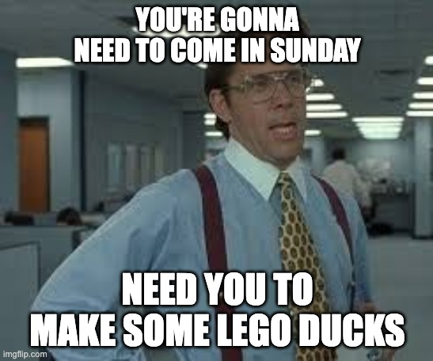

_Are you PP-pilled?_ 

The Predictive Processing (PP) model is an awesome account of cognition. It's a unified
theory of psychology and neuroscience, it seems to have strong
theoretical and empirical support, and it tries to explain an ambitious 
eternal question: **how do minds work?**

What minds do is _predict_. They predict their sensory 
inputs, and that allows them to _ignore_ most of the actual sensory data. They 
just have to update based on errors. Predictions flow _down_ from higher level 
nodes, and updates flow _up_ as feedback from the world corrects the predictions.

In the PP model, _action is a form of prediction_. Mirroring the way the mind 
reduces error by updating its internal model based on sensory data, it
can also reduce model error by _changing the world_. Predict that you are
drinking your coffee? Reduce the model error by moving your arm towards the
counter, closing your hand on the handle of the mug, and bringing the coffee to
take a sip.

Granted, this is a _weird_ way to think about action. We don't normally think of
ourselves as "reducing model error" when we decide what to do and then do it.
Still... the PP folks are getting cool results in the lab and in the 
theory-mills by lumping everything minds do under the big heading "prediction".

## Today's Paper

Today's paper is [Play in Predictive Minds: A Cognitive Theory of Play](/play-in-predictive-minds.pdf) 
by Andersen, Kiverstein, Miller, & 
Roepstorff (2022). From the title and my intro, you can guess that it's about
play and the PP model.

I really like this paper. It's long-winded and a little hard to read if you
don't share the context the authors do, but it's attempting to draw together
really disparate threads about cognition and learning. I have been wondering
about the questions the authors attempt to answer for a few years.

<blockquote class="twitter-tweet">
If the predictive processing model of the mind is right, what will the practical implications be for learning and teaching?
&mdash; Rob Cobb (@robcobbable) <a href="https://twitter.com/robcobbable/status/1334640102170120192?ref_src=twsrc%5Etfw">December 3, 2020</a></blockquote>

## Intro

I'm going to pull some key quotes and then react in-line. The
paper is a little long, but if something from the summary catches your eye, go 
forth and [read the full thing!](/play-in-predictive-minds.pdf)

> We propose that play is a behavior in which the agent, in contexts of freedom from the demands of certain competing cognitive systems, deliberately seeks out or creates surprising situations that gravitate toward sweet-spots of relative complexity with the goal of resolving surprise.

Okay, play is about creating and resolving surprising situations.

> We further propose that play is experientially associated with a feel-good quality because the agent is reducing significant levels of prediction error (i.e., surprise) faster than expected. Such a strategy of seeking and creating surprising situations, we argue, is in many ways optimal for learning in that it not only maximizes the speed at which learning takes place, but also enables optimized learning strategies, even in instances where opportunities to learn may be scarce.

Seems like this **prediction error** thing is really important. It seems
counterintuitive that play, which deliberately _creates_ surprising and novel 
situtations, might actually be about _reducing_ surprise in the long run.

> the theory integrates the role of positive valence in play, that is, **it explains why play is fun**

Bold! (emphasis mine) 

> it expands on the relationship between emotions and mood states, that is, playfulness, as they often occur in the context of play

Really going for broke in this paper. Answering "why is it fun to play" isn't enough!
They're also going to (partially) answer "how do emotions relate to moods".

> A consistent theme in cognitive theories of play is that children are motivated to play to make progress in learning, reducing their uncertainty, and allowing them to better predict the effects of their actions on the world 

Okay, so, one thing that takes a little getting used to is this idea that play
is for learning. On the surface, it seems wrong! 

'Play' feels so different from the connotations that we associate with 'learning' 
that 'play is for learning' feels like a big leap. The paper isn't saying that 
kids _consciously_ decide to play in order to learn, or something alien like that. 
These researchers have met kids before! They just use words a little differently.

What makes a game fun? Well... it's _not boring_. It's... interesting.
It's...surprising! It has an element of novelty!

When these researchers say that children play because of 'motivation to make 
progress in learning', they mean something like 'children play games that are 
interesting and novel' not, like, they play because they want to do better 
in their math class.

They do come out and say it:

> The motivation to gain new information that reduces overall uncertainty in play suggests that children should be attracted toward novelty, ambiguity, and surprise in play.

For me, it was super important to keep this distinction in mind through the whole paper -- it's
not about what kids are _thinking about_ when they play, or their conscious
decision making process. Instead, it's about _what the brain is seeking_.

A similar distinction to remember is that in this paper, 'learning' means
'changes to the brain's model of the world'. Not education, not learning that's
connected to a long-term goal, not learning to do something. Just 'brain
updates'.

A concrete example from the paper:

> These authors [referring to Spinka et al., 2001] argue that play fighting and locomotor play are forms of “training for the unexpected,” and that they allow mammals to develop flexible motor responses and emotional coping strategies for unexpected situations. Spinka et al argue that mammals “actively seek and create unexpected situations in play through self-handicapping; [ … ] actively putting themselves into disadvantageous positions and situations”

The animals are not play fighting to get better at math. They are developing
flexible motor responses.

Note that play is about _actively seeking the unexpected_. We'll also see
self-handicapping again later on.

> [several studies that all show that children play more with toys or situations that are confusing or surprising: Bonawitz et al. (2012), Schulz and Bonawitz (2007), Schulz et al. (2008),  van Schijndel et al. (2015), Butler & Markman (2010), Stahl and Feigenson (2015), Stahl & Feigenson (2019), Perez & Feigenson (2020)]

The bibliography for this paper is huge. Tons of references and citations. These
are all studies that support the author's starting point that play is about
novelty and learning about the world.

Some of the papers they cite seem super fun:

> In adults, a recent study (Heimann & Roepstorff, 2018) provided participants with five sets of six LEGO bricks, and instructed them to build a small duck. Participants were assigned to two conditions: A playful condition in which they were asked to build ducks in a way that felt playful to them, and a nonplayful condition in which participants were asked to build ducks in a way that did not feel playful at all. While participants created a multitude of different ducks in the playful condition, they tended to reproduce similarly designed ducks in the nonplayful condition. [...] The study found that participants in the nonplayful condition generally reported feelings of stress, obligation, and boredom, while participants in the playful condition reported feeling autonomy and, interestingly, feelings of surprise over the ducks they had ended up building. The study showcases a somewhat counterintuitive phenomenon, namely that **individuals can surprise themselves during solitary play with objects.** [minor edits for clarity, emphasis mine].

Wow. Cueing the task differently totally changes the emotional relationship
to the task! Reminds me strongly of ["Let's think step by step" prompts for LLMs](https://twitter.com/arankomatsuzaki/status/1529278580189908993).

Also, I'm struggling to picture the non-playful condition here. Telling adults to
build LEGO ducks seems inherently playful! Maybe they recruited this guy as an
experimenter.

> In sum, belief-violation, ambiguity and novelty provide children with learning opportunities to improve their intuitive theories of the world and its causal workings.

Cool.

## The Sweet Spot

How confusing or novel should play be? Some kids like a lot of chaos, but others
not so much.

> learners are attracted to surprising and novel information that tends to gravitate toward a sweet spot of complexity that is neither too simple, nor too complex given what they already know.

> Intuitively speaking, it seems likely that overly predictable play is boring and overly unpredictable play chaotic.

Checks out. Boring means that something is predictable, which means there's
nothing more for your mind to learn about it. Infants laugh outrageously at
things that are mundane for us olds.

> Infants, for example, seem to be guided by the so-called “Goldilocks principle” in their preference for visual stimuli which are neither too simple nor too complex

It's wild to see what entertains an infant! Stimuli!

(btw, I'm cutting a lot of the citations, there's a lot more backing up these claims
in the actual paper)

> The immersive experience of “flow,” characteristic of playful states, tends to occur during tasks which are just within reach of one’s ability

Ooh, wasn't expecting to see flow in this paper! What a nice surprise. I don't
know that 'fun' is the same thing as flow, but it's interesting that the authors
posit a relationship. Imo, flow can be more boring, play almost definitionally
can't be boring.

> play frequently involves self-handicapping behavior, like hopscotch, where individuals deliberately make already learned tasks harder and thus more surprising for themselves

I sometimes analogize learning exercises to resistance training, where you
impose some artificial constraints on your movements to get some benefit. Now
I'm gonna switch my go-to analogy to hopscotch, since it's so vivid and fun!

Imposing constraints on yourself to make something harder is super
characteristic of play, and it feels weird that I didn't see it until now!

> in a recent study on play and fear, where older children and adult visitors to a haunted attraction were equipped with heart rate monitors and asked to report on their experience (Andersen et al., 2020) [...] self-reported enjoyment had an inverted U-shaped relationship with self-reported fear

There's a sweet spot of challenge / novelty / complexity. This isn't a big
surprise! To me, it bears a striking resemblance to the [Zone of Proximal Development](https://en.wikipedia.org/wiki/Zone_of_proximal_development) or less formally, the [Learning Zone](https://www.mindtools.com/pages/article/learning-zone-model.htm) (between the Comfort Zone and Panic Zone).

It also gives a cognitive theory to support education catchphrases like "low 
floors, high ceilings, wide walls". We want to create environments where
learners navigate to the appropriate level of complexity and challenge for them.
Importantly, that level will change as students become more comfortable! In
order for it to feel 'playful', the difficulty / novelty / complexity has to
increase.

If you've ever played Portal (or other games that have a quirky physics or
'fun' set of world-rules to learn), you've seen the difficulty ramp in action. 
The game is fun because it violates your expectations, but only a little bit at
a time. There's a steady drip of new challenges and surprises to master.

> a strong driver of curiosity is the learner’s metacognitive estimates of their own prior knowledge, meaning that learners will have their curiosity piqued when they think that they are close to knowing the answer to a question

Again -- this is not student's explicit, articulable, conscious estimate of 
their own knowledge. The _feeling_ of curiosity is a signal that you've got 
enough information to put together a new answer!

This is really cool, imo. Students are uncurious if something is too hard, or if
there's no mystery left to resolve.

Emotions are our 'readout screen' for our brain's state. They reliably tell
us... something. Curiosity is a signal of our brain's hidden estimate of how 
close we are to learning something new. Seems important!

Telling kids to 'follow their curiosity' is like telling them to 'go north' on
the compass. It's reliably pointing towards experiences that are likely to turn
into learning... at least, their brain's best guess for that!

## Predictive Processing

My summary at the start of the post introduces the PP model, but here it is in
the words of the paper authors:

> The brain uses prior knowledge to form top-down predictions, which are then compared to bottom-up sensory input. Mismatches between predictions and sensory input elicit prediction error signals, which the brain continuously attempts to minimize.

> Predictions are thought to occur at multiple hierarchically organized levels which simultaneously operate across different spatiotemporal scales. This can be conceptualized as a hierarchical generative model (Friston, 2008; Parr & Friston, 2018)3 where lower levels deal with states of affairs happening at faster time scales and are good for handling detail, whereas higher levels deal with regularities operating at slower time scales, which are usually more general and abstract in nature.

I didn't focus on the levels and heirarchy bit so much in my summary, but it's a
core part of the theory.

> When mismatches between predictions and sensory input arise, the organism has
> two main options available to minimize the overall level of prediction error. It
> can either update predictions to better account for the sensory input through
> perception (also referred to as “perceptual inference”) or, alternatively, use
> action (also referred to as “active inference”) to make the world align with its
> predictions, sometimes preventing the errors from arising in the first place
> (Feldman & Friston, 2010; Friston, 2009; Friston et al., 2010).

My summary mostly matches the authors'. Experientially: This is boring to
read, because it doesn't contain much that's new. (!!!)

> Imagine, for example, that you are waiting for your partner at a designated meeting place. As you see your partner approaching from afar, you eagerly wave. As your “partner” approaches, however, your prediction errors start to increase, forcing your internal model to rapidly update. Suddenly, you realize that you have been waving at a complete stranger. Conversely, it may be the case that your partner is sitting on a bench with their back turned to you. Since you are still not entirely sure that it is in fact your partner sitting there, you attempt to reduce your prediction error through action: You move around the bench, trying to find a better angle from which to catch a glimpse of the face of the person sitting there. Finding that it is in fact your partner, you have now successfully aligned the world with your predictions.

There's lots more to read about the PP model. The book treatment of it is Andy
Clark's [Surfing Uncertainty: Prediction, Action, and the Embodied
Mind](https://www.amazon.com/Surfing-Uncertainty-Prediction-Action-Embodied/dp/0190217014). 
It's... pretty academic. Most readers of this summary might be better off with the excellent (and _readable_) [SSC review](https://slatestarcodex.com/2017/09/05/book-review-surfing-uncertainty/). 
Having read the review, and then purchased and attempted to read the book, I 
think I only made it about halfway through. It's so comprehensive!

> In sum, predictive processing “depicts perception, cognition, and action as the closely woven products of a single kind of inferential process”

## Play and Predictive Processing

Now the heart of what the paper is about:

> When children are well fed, warm, and healthy, they do one thing above all: play. It seems quite clear that when they do so, they thoroughly enjoy exploration, experimentation, and surprise. But why? Why do children engage in surprise-inducing activities such as pretend, play-fight or hopscotch if their brains are fundamentally designed to reduce prediction errors? Why would a brain on an eternal quest to minimize predictions errors dabble in something as anarchic as play where unpredictability and error abound (Sun & Firestone, 2020)?

The short answer:

> surprise, understood as short term, significant increases in prediction errors, may result in long-term error minimization. 

Short term trades off against the long term.

> Children may, for example, experience surprise in the short term when playing with the bathroom faucet (signifying that their predictions have been violated), but this may reduce the amount of prediction errors associated with using the faucet in the long term.

It's so fun for me to mentally contrast the seriousness of the fancy academic paper
with the subject. 

"Kids playing with the faucet" is a vivid and relatable
example, I'm just laughing thinking of them with clipboards watching kids turn
the water on and off and saying things like "hmmmm, little Mary may be increasing her 
prediction error in the _short term_, but her behavior may be part of a strategy
that minimizes prediction error in the _long term_" and like, pushing their
glasses up their nose nerdily. 

(NB: I am a nerd and push my glasses up my nose
after saying ironically obtuse shit like this, no knock on the authors, who I
assume have 20/20 vision and are normal sounding humans at home).

> The overall objective of active inference is to reduce prediction error over time, and sometimes meeting this objective calls for an agent to gain new information so as to reduce its uncertainty. This means that **novel or ambiguous stimuli**, which may at the point of first encounter be some what unpredictable, are also **rendered instantly attractive, because they represent “expected surprise” or “uncertainty”**

New things are fun! And... they're fun because reducing long term predictive
error is fun?

> the predictive processing framework proposes that all explorative behavior [...] can be explained with reference to a single cognitive mechanism: Actual or expected prediction error minimization

That's definitely predictive processing. It's _all_ prediction!

It gets me thinking about the subjective experiential difference between
reducing expected vs. actual prediction error. Reducing _actual_ error means
making the world fit your model -- successfully achieving some goal. Reducing
_expected_ error is like learning a new fact about the world. It doesn't 
necessarily feel the same as _success_ in changing the world -- it feels good 
in some other way.

> expected surprise summons up an irresistible desire to explore, to handle, and to experiment—in short, to play.

~"Let's think step by step"~ "Let's do something new!"

> Whereas child cognition is characterized by a desire to learn through exploration, adult cognition is characterized by a desire to exploit what is already known to plan and make things happen. The child’s motivation for active exploration and play is in tension with adult cognition that is characterized by “attentional focus, inhibition and executive function and behaviors like long-term, goal-directed planned action”

oops, designed schools wrong 😳

Adults don't play like kids do - they are trying to actually succeed, not just
'fool around'. They make the trade-off differently between exploring new things
(play) and actually trying to succeed.

(The authors bring up explore/exploit and 'model temperature' and simulated
annealing, in case there are any annealing stans in the audience.)

## Surprise and Fun

> when prediction error is being reduced faster than expected, the associated experiences will be positively valenced. When prediction error is being reduced slower than expected, the associated experiences will be negatively valenced.
 
This is a really interesting (and sorta twistily meta) point. The brain has an
expectation for how fast it'll learn. It's fun when you're faster than that
rate, and not fun if it's slower than that rate.

> Play activities will thus be fun if the activity allows the agent to make better than expected progress in prediction error reduction. In essence, the good feeling one gets from play is thus tantamount to inferring that “I am doing well.”

Importantly, 'doing well' here means something like 'learning fast'. It's not
about performance within the external rules of play. This _sorta_ tracks, but
maybe it's missing something. The external feedback from winning according to
the rules of play matters. Winning is more fun than losing, even if the rate of
learning is really quick...

> an answer to the question of why play is rewarding and fun. In play the agent is drawn to new surprising information that is neither too complex and chaotic, nor too simple as to promise only meager, uninteresting advances in learning. Surprising situations that fall within this sweet spot will allow the agent to do better than expected at reducing error, which, in turn, feels good.

'Reducing error faster than expected' is the thing that feels like fun.

That's the case whether the reduction in error comes from mental updates or from actions.

> Alternatively, in play, agents may attempt to make the surprising reality conform to their predictions. In short, play is fun because it allows for the discovery of new and improved strategies for rapid prediction error reduction either through learning and forming new predictions or by making the world conform to our predictions

So maybe this explains why winning feels good? 

Acting to make the world conform to our (predictions/desires) is satisfying. 
When you win, you are reducing actual predictive error, because you make the 
world conform to your expectation. "Faster than expectation" here might 
correspond to winning in situations that were unlikely or more challenging; 
beating the big boss is more fun than beating the little grunt.

The thing where PP blurs the boundary between a desire and a prediction shows up 
here. Normally, we use different words for 'goal' and 'expectation', but PP 
doesn't model those super differently in the brain. 

(Note: the authors have an upcoming paper _Mastering uncertainty: A predictive
processing account of enjoying uncertain success in video game play_ which
sounds like it will explore this topic more. I'm pretty excited for it!)

## Getting to the Goldilocks point

> In order to enjoy prolonged periods of fun and enjoyment, the playful agent may purposefully design and create situations characterized by an estimated just-right amount of surprises 

> situations that are neither too simple, nor too complex, are the ones that afford the richest opportunities for improving the rate of prediction error minimization, giving rise to situations where individuals are reducing prediction error faster than expected.

> this characterizes a fundamental aspect of play: The tireless pursuit of just-right surprises

Seeking novelty but not too much difficulty... this is what play looks like!

Kids get intimidated, frustrated, or turned off by things that seem to hard, and
bored by things that are old or too easy. I'm glad that the theory matches our 
intutions about what play behaviors are like.

> For example, children may build a block tower to see what happens when they knock it over; they may transform a banal piece of asphalt into a hopscotch grid; and they may turn a dreary stack of blankets into a fort to defend the center of the living room. Through these means, **in a hunt for positive valence, children create and establish an environment tailored to the generation and further investigation of surprise and uncertainty.**

'Creating surprise and uncertainty' isn't an obviously what
characterizes play, but it does seem true.

> One could say that play is not only about epistemic foraging, it is also about epistemic farming.

I _love_ this quote. "Epistemic foraging" and "epistemic farming" are so evocative!

> As they play, humans in general, and children in particular, sometimes deliberately forge error-inducing environments, in order to allow for the further exploration of productive surprises.

With one arm behind my back!

It's funny to think of some games that are basically just this dynamic.

As kids, we played a lot of 'HORSE'. Players would alternate turns, attempting 
to make difficult shots (especially basketball, but any net sport works). Very
often, we'd self-impose handicaps, like "off-handed" or "behind the back", to
make it more challenging.

What a weirdly pure version of play!

> The reason why children, in ways that might seem quite pointless, may actively create surprising situations and environments that they eventually find ways to resolve is because doing so feels good.

This smells a lot like "constraints breed creativity". It could be there's a better
explanation for this, but here's my version of it under the PP model:

- a task might feel either too easy or too hard, so you're disinterested
- adding constraints moves it into the 'Goldilocks zone', where your brain
    expects that you will learn (i.e. reduce predictive error) at a fast rate
- that makes you feel curious, playful, and fun
- which in turn makes it interesting -- fun is an emotion for directing your
    attention, as well as boosting your creativity 
- so, you can be really generative and end up having more creative success in
    the (perhaps artificial) situation with more constraints

I don't quite have a model for how the creativity part works, but feeling
interested / playful seems like an ingredient.

> A series of descriptive findings on the development of play can highlight some of the strategies children utilize across development to ensure they are neither too surprised nor too bored while playing.

There's a bunch more examples in the paper that all seem to accord with this
model of play and PP. They're fun but long, so I'm leaving them out.

but okay here's a few:

> [Rough and Tumble play] is very often characterized by some form of self-handicapping behavior, especially in cases involving unequally strong partners (Pellegrini, 2006). For example, when an adult and a child play-fight, the adult may sit on his knees and maybe keep one arm behind his back

With one arm behind my back! Wow, I really feel vindicated.

> clowning and teasing can take endless forms, but what these forms share is a violation of normal expected patterns of social life

endless clowning, yeah, checks out (@ my brothers)

> children not only infer playful behavior from observed violations of rational actions, but take on unnecessary costs themselves and perform inefficient actions

like balancing on the curb when walking on the sidewalk, gotcha, gotcha

>  pretend play is much like the imaginary world “Twin Earth,” a concept that philosophers sometimes use in their thought experiments

philosophers acting like children, yep

> opportunities of exploring different strategies for error reduction, including social strategies for negotiation and making the world conform to the agent’s expectations (e.g., “[W]ill you be the king, Dad? … No, you can’t be the prince, cause there is no prince on Atecopia, so you can only be King”, Andersen, 2022).

These researchers have indeed met children!

## Mood

The authors have a big digression into mood, which seems cool and related, but
less certain than the rest of the paper:

> Moods are often described as “generalized emotions,” emotions that are
> directed at the world as a whole rather than any one particular object [...] A positive mood, then, can be understood as the product of a series of experiences where the organism has reduced error faster than expected.

Big if true! 

Learning, playing, and having fun _in general in your life_ could
make you happy _in your whole life_. This on the speculative end of the paper,
but it seems like it has implications for overall mental health.

> In this perspective, moods reflect a sort of emotional “momentum”—when the agent feels rewarded for doing better than expected, it increasingly expects such rewards to keep on coming (and conversely, when agents are doing worse than expected, it incrementally expects more bad times ahead)

Mood is big emotion, __ is big mood.

> in depression, a state characterized by a persistent negative mood, there is a loss of confidence that any policy will succeed in reducing error (Badcock et al., 2017). This sometimes creates a perpetuating negative spiral, where the expectation of encountering worse than expected slopes for error reduction leads the agent to sample the environment for evidence, which in turn confirms and supports the negative belief. In that sense, playfulness as a mood can be thought of along the same lines as the famous words of Brian Sutton-Smith, who stated that the opposite of play is not work; it is depression.

🤯

**The opposite of play is not work, it is depression**

Feels very true, but it's also so quotable that I don't know if I am a fair
judge of its true insightfulness.

## Conclusion

Okay, so what's it all mean for us?

As always, I'm looking for the implications for learning design. 

There's been a long-standing call to "make learning fun". I think this paper
basically says that, in the PP model of the world, "fun" means that you're
learning, and if it's not fun, you aren't learning (or, at least, aren't
reducing predictive error faster than your brain's expected rate).

It's not new to try to tune a learning experience so that the difficulty, pace, 
and challenge are appropriate. What is new is to set 'play' as the goal for what
successful pacing looks like! 

**If you've tuned your difficulty appropriately, learning
will feel like playing**.

Boredom and frustration are signals that the design is too easy, too hard, or 
not novel enough. If the learner's brain expects to learn quickly, then they 
will feel curious. If they are currently learning quickly, that will feel fun 
to them.

**Learner's emotional reaction is a signal of how well-tuned a challenge is**

> we speculate that proneness to boredom and a proclivity to play may act as a creative stimulus for cultural innovation

Creative people are playful! Playful people are creative!

Also... playful means that you get bored easily. Ummm... don't know what to do
about that one 😬.

One idea is that if you are bored, you can deliberately introduce constraints to
make things more fun for yourself. It's sort of an obvious trick, but this is a
good reminder that you can bring play and joy into your life on purpose.

Expectations matter, and they are socially contingent:

> When the 4-year-olds completed the puzzle that they were told was hard (i.e., presumably completed the puzzle faster than expected), they spent more time exploring and attempted more different interventions with a subsequent novel toy compared to when they were told that the puzzle was easy or at baseline when no difficulty information was provided.

> results suggest that “children consider others’ knowledge and selectively interpret others’ surprise as vicarious prediction error to guide their own exploration [Wu and Gweon, 2021].

In these reviews, I try to call out things that I think are surprising! I am 
guiding your attention to things that, to me, seem novel or interesting, or 
might cause you to update. That's... fun, I hope 😜.

--

Overall, I really like this paper. It'd have been more fun if it was shorter,
and if they didn't talk like aliens, but that's academic writing for ya!

> It may be that when agents have fun together, they do so by collaboratively reducing error for each other.

That's my idea of a good time 😉

Hope this was your idea of a good time too! If it was, let's collaboratively reduce
error for each other 😅. Message me what you think, or share the link with a
friend.

_Thanks to Marc Anderson for draft feedback, especially pointing out where I had
confused a model update with prediction error reduction. Those are related, but
not the same thing! Remaining errors or misleading explanations are all mine._
